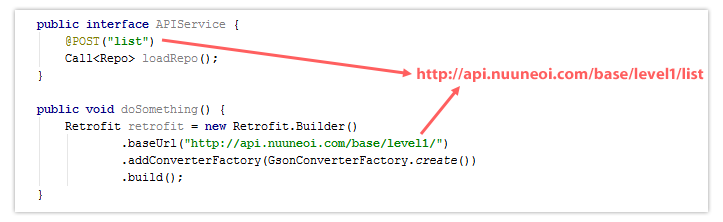

# Retrofit 2.0
[github 地址](https://github.com/square/retrofit)
Retrofit入门可以参考 [Retrofit - Java(Android)的REST接口封装类库](http://www.tuicool.com/articles/NnuIva)
## 引入Retrofit 2.0 新版本
如果想在自己的项目引入Retrofit 2.0，那么在build.gradle引入依赖一节里添加如下代码

> compile 'com.squareup.retrofit:retrofit:2.0.0-beta1'

sync gradle 以后就可以使用Retrofit 2.0

## 新的Service的定义方式
``` Java
    import retrofit.Call;

    /* Retrofit 2.0 */

    public interface APIService {

        @POST("/list")
        Call<Repo> loadRepo();
    }
```
而创建Service的方法和Okhttp的模式一模一样。如果要调用同步请求，只需要调用execute；如果要发起一个异步请求
则需要调用enquene。
#### 同步请求
``` Java
    // synchronous Call in retrofit 2.0

    Call<Repo> call = service.loadRepo();
    Repo repo = call.execute();
```
以上代码会阻塞线程，因此不能在安卓的主线程中调用，不然会面临NetworkOnMainThread Exception。
如果你想调用execute，请在后台线程中执行。
#### 异步请求
``` Java
    // asynchronous Call in retrofit 2.0

    Call<Repo> call = service.loadRepo;
    Repo repo = call.enquene(new Call<Repo>() {
    @Override
    public void onResponse(Response<Repo> response) {
        // Get result Repo from response.body()
    }
 
    @Override
    public void onFailure(Throwable t) {
 
    }
    });
```
以上代码发起一个在后台执行的一个线程，并冲response.body()方法中获取一个结果对象。注意这里的onResponse() 和 onFailure都是在主线程
中调用的，最好使用enquene方法。

## 取消正在进行的业务
service模式变成Call的形式的原因是为了让正在进行的线程可以被取消。要做到这点，只要调用call.cancel()。
``` Java
    call.cancel();
```
## Converter现在从retrofit中删除
在retrofit 2.0 中，Converter已经不在package中了。你需要插入一个Converter，不然的话只能接受字符串结果。同样的
Retrofit 2.0 y也不再依赖于Gson。

如果想接受 json 结果，你必须吧Gson Converter作为一个独立的依赖添加进来。
``` Java
compile 'com.squareup.retrofit:converter-gson:2.0.0-beta1'
```
然后使用AddConverterFactory把它添加进来。
``` Java
    Retrofit retrofit = new Retrofit.Builder()
            .baseUrl("http://api.nuuneoi.com/base/")
            .addConverterFactory(GsonConverterFactory.create())
            .build();
 
    service = retrofit.create(APIService.class);
```
下面是Square提供的官方Converter modules列表

Gson: com.squareup.retrofit:converter-gson

Jackson: com.squareup.retrofit:converter-jackson

Moshi: com.squareup.retrofit:converter-moshi

Protobuf: com.squareup.retrofit:converter-protobuf

Wire: com.squareup.retrofit:converter-wire

Simple XML: com.squareup.retrofit:converter-simplexml

你也可以通过实现[Converter.Factory](https://github.com/square/retrofit/blob/master/retrofit/src/main/java/retrofit/Converter.java)接口来创建一个自定的converter。

## 自定义Gson对象
为了以防你需要调整json里面的一些格式，比如，Date Format。你可以创建一个Gson 对象并把它传递给GsonConverterFactory.create()。
``` Java
    Gson gson = new GsonBuilder()
        .setDateFormat("yyyy-MM-dd'T'HH:mm:ssZ")
        .create();

    Retrofit retrofit = new Retrofit.Builder()
            .baseUrl("http://api.nuuneoi.com/base/")
            .addConverterFactory(GsonConverterFactory.create(gson))
            .build();
 
    service = retrofit.create(APIService.class);
```
## URL定义方式
Retrofit 2.0使用了新的URL定义方式。Base URL与@Url 不是简单的组合在一起而是和\<a href="..."\>的处理方式一致。用下面的几个例子阐明。





第二种比较符合我们的习惯，一般建议BaseUrl带'/', @Url不要带'/'

比如
``` Java
    public interface APIService {
    
        @POST("user/list")
        Call<Users> loadUsers();
    
    }
    
    public void doSomething() {
        Retrofit retrofit = new Retrofit.Builder()
                .baseUrl("http://api.nuuneoi.com/base/")
                .addConverterFactory(GsonConverterFactory.create())
                .build();
    
        APIService service = retrofit.create(APIService.class);
    }

```
而且Retrofit 2.0 还可以在@Url中定义完整的URL
``` Java
    public interface APIService {
    
        @POST("http://api.nuuneoi.com/special/user/list")
        Call<Users> loadSpecialUsers();
    
    }
```
这种情况下Base Url 可以忽略
#### 需要OkHttp的支持
在Retrofit 2.0 中依赖OkHttp，并且设置了自动依赖。下面是从Retrofit 2.0的pom文件抓取的。不需要再做任何事情了。
``` Java
    <dependencies>
    <dependency>
        <groupId>com.squareup.okhttp</groupId>
        <artifactId>okhttp</artifactId>
    </dependency>
    
    ...
    </dependencies>
```
为了让Okhttp的Call模式成为可能，在Retrofit 2.0 中OkHttp自动设置为Http的接口。
## 即使response存在问题，onResonse存在问题，依然会调用
在Retrofit 2.0中，不管response能否被解析，onResponse总是被调用。但是当结果不能被解析时，response.body()
会返回null，需要处理这种情况。

如果response存在什么问题，比如404什么的，onResponse依然会被调用。你可以从response.errorBody()中获取
错误的主体
## Use an Interceptor from OkHttp
在Retrofit 1.9中，你可以使用RequestInterceptor来拦截一个请求，但是它已经从Retrofit 2.0 移除了，因为HTTP连接层已经转为OkHttp。

结果就是，现在我们必须转而使用OkHttp里面的Interceptor。首先你需要使用Interceptor创建一个OkHttpClient对象，如下：
``` Java
    OkHttpClient client = new OkHttpClient();
    client.interceptors().add(new Interceptor() {
        @Override
        public Response intercept(Chain chain) throws IOException {
            Response response = chain.proceed(chain.request());
    
            // Do anything with response here
    
            return response;
        }
    });
```
然后传递创建的client到Retrofit的Builder链中。
``` Java
    Retrofit retrofit = new Retrofit.Builder()
        .baseUrl("http://api.nuuneoi.com/base/")
        .addConverterFactory(GsonConverterFactory.create())
        .client(client)
        .build();
```
学习关于OkHttp Interceptor的知识，请到[OkHttp Interceptors](https://github.com/square/okhttp/wiki/Interceptors)。
## RxJava Integration with CallAdapter
除了使用Call模式来定义接口，我们也可以定义自己的type，比如MyCall。。我们把Retrofit 2.0的这个机制称为CallAdapter。

Retrofit团队有已经准备好了的CallAdapter module。其中最著名的module可能是为RxJava准备的CallAdapter，它将作为Observable返回。要使用它，你的项目依赖中必须包含两个modules。

``` Java
    compile 'com.squareup.retrofit:adapter-rxjava:2.0.0-beta1'
    compile 'io.reactivex:rxandroid:1.0.1'
```
Sync Gradle并在Retrofit Builder链表中如下调用addCallAdapterFactory：
``` Java
    Retrofit retrofit = new Retrofit.Builder()
            .baseUrl("http://api.nuuneoi.com/base/")
            .addConverterFactory(GsonConverterFactory.create())
            .addCallAdapterFactory(RxJavaCallAdapterFactory.create())
            .build();
```
你的Service接口现在可以作为Observable返回了！
``` Java
    Retrofit retrofit = new Retrofit.Builder()
            .baseUrl("http://api.nuuneoi.com/base/")
            .addConverterFactory(GsonConverterFactory.create())
            .addCallAdapterFactory(RxJavaCallAdapterFactory.create())
            .build();
```
你可以完全像RxJava那样使用它，如果你想让subscribe部分的代码在主线程被调用，需要把observeOn(AndroidSchedulers.mainThread())添加到链表中。
``` Java
Observable<DessertItemCollectionDao> observable = service.loadDessertListRx();
 
observable.observeOn(AndroidSchedulers.mainThread())
    .subscribe(new Subscriber<DessertItemCollectionDao>() {
        @Override
        public void onCompleted() {
            Toast.makeText(getApplicationContext(),
                    "Completed",
                    Toast.LENGTH_SHORT)
                .show();
        }
 
        @Override
        public void onError(Throwable e) {
            Toast.makeText(getApplicationContext(),
                    e.getMessage(),
                    Toast.LENGTH_SHORT)
                .show();
        }
 
        @Override
        public void onNext(DessertItemCollectionDao dessertItemCollectionDao) {
            Toast.makeText(getApplicationContext(),
                    dessertItemCollectionDao.getData().get(0).getName(),
                    Toast.LENGTH_SHORT)
                .show();
        }
    });
```